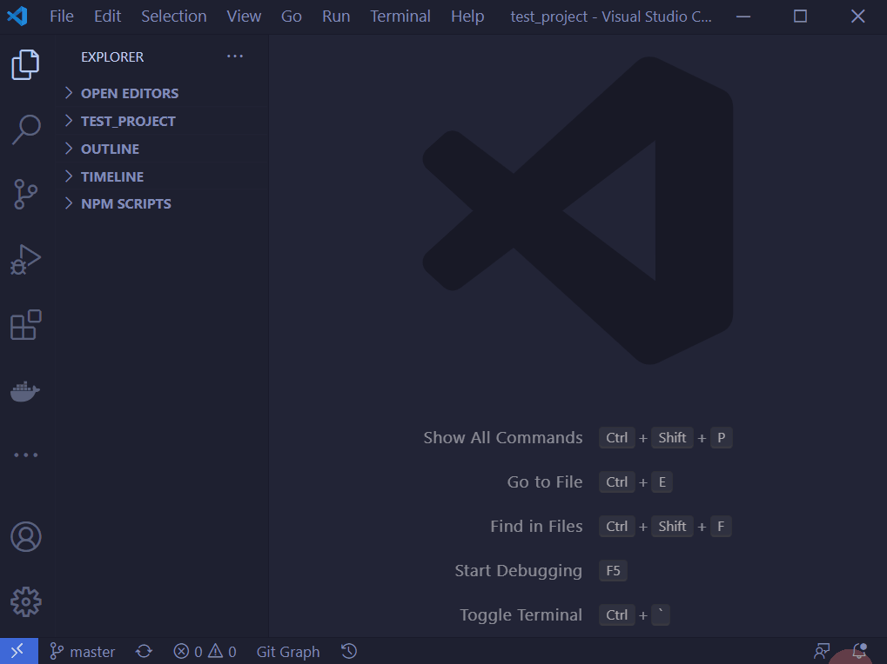

There a many ways to create a branch in the git process. Two options are highlighted below.

[[_TOC_]]

# Option 1: Using VSCode

**Note this is a local branch. You need to push it before it is also on the remote.**

# Option 2: In Gitlab

**Note you need to checkout this branch locally as this only creates the branch on the server.**

# Option 3: Command Line
If you want to use this option, you don't need a guide!