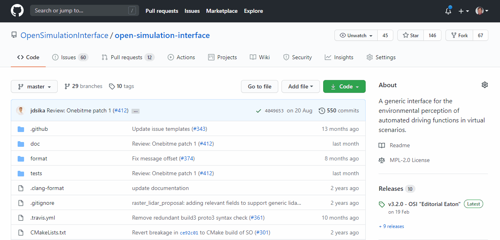
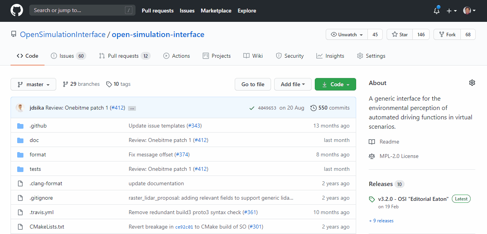

Creating a fork "clones" the repository into your profile, allowing you to make changes without having to interact with the main repository.

>The procedure is the same on code.asam.net (gitlab) and on github.

To submit the changes you make in your fork back to the repository, submit a Merge/Pull request as normal in the main repository, making sure to select your fork.

