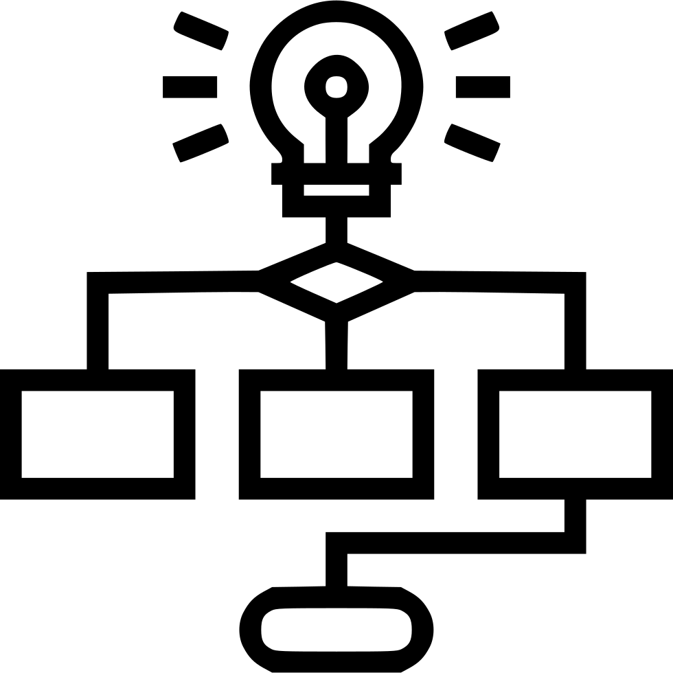

= ASAM Wiki
This Wiki provides information on how to *set up accounts and tools* for working on ASAM projects. It also details the *general processes and workflows* employed by ASAM to ensure a _consistent_ and _efficient_ standardization. In addition to general information, each projects has its own project Wiki for project specific knowledge and definitions. Lastly, the ASAM Wiki provides *introductions to and reference pages for the proposed tools*.

_Following these guidelines will minimize process overhead and increase the speed at which your input is integrated into the standard._

[cols=">1,^1,^1,^1"]
[grid="none",frame="none"]
[]
|===

4+^h|General Wiki --  Quick Access

|<<First Time Setup,**Setup**>>
|image:docs/images/GettingStarted.jpg[width=120,title="First Time Setup",link="docs/general_guidelines/Setup-Guide.asciidoc"] + 
link:docs/general_guidelines/Setup-Guide.asciidoc[First Time Setup]
| +
link:docs/general_guidelines/Microsoft-Teams-and-Sharepoint.adoc[Teams & Sharepoint]
|image:docs/images/Calendar.png[title="OpenX Calendar",width=120,link="docs/general_guidelines/Shared-OpenX-Calendar.adoc"] +
link:docs/general_guidelines/Shared-OpenX-Calendar.adoc[Shared Project Calendar]

|<<Guidelines,**Guidelines**>>
| +
link:docs/general_guidelines/Workflow.asciidoc[Repository Guidelines]
|image:docs/images/ProjectGuidelines.png[title="Project Guidelines", width=120, link=docs/general_guidelines/ProjectGuidelines.adoc] +
link:docs/general_guidelines/ProjectGuidelines.adoc[Project Guidelines]
| +
link:docs/general_guidelines/WritingGuidelines.adoc[Writing Guidelines]

|===

---

== First Time Setup

***You are new to ASAM projects? Then start here!*** 

In order to participate in the ASAM standardization, users need to set up their account and tools and connect to the communication channels the group uses.

1. The **link:docs/general_guidelines/Setup-Guide.asciidoc[setup guide]** provides a step-by-step on setting up your GitLab account and installing the tools recommended by ASAM for interacting with ASAM standards and repositories. You also find information on how you can, alternatively, participate without having to install tools on your PC.

2. The guide to **link:docs/general_guidelines/Microsoft-Teams-and-Sharepoint.adoc[Teams & Sharepoint]** contains information on setting up Microsoft Teams.

3. The guide for the **link:docs/general_guidelines/Shared-OpenX-Calendar.adoc[OpenX calendar]**, a shared calendar across all ASAM OpenX projects that lists all meetings taking place, provides instructions on how to synchronize this calendar with your company's to keep all relevant meetings together.

---

== Guidelines

In order to keep all ASAM projects aligned, each project follows the same basic workflows and uses the same guidelines for the **<<repository-guidelines,repositories>>** (how to use GitLab), the **<<project-guidelines,projects>>** (how projects are structured), and for **<<writing-guidelines,writing>>** (how to create content for the standards).

---
=== Repository Guidelines
The repository guidelines cover all topics related to working with the repository (GitLab). See the **link:docs/general_guidelines/Workflow.asciidoc[Workflow Overview]** for a walkthrough on how to actively develope the ASAM standards.

A list of available labels in ASAM repositories can be accessed through the **link:docs/git/ASAM-Issue-and-MR-Labels.md[Overview Of Labels]**.

_For information on how to set up your GitLab account, see **link:docs/general_guidelines/Setup-Guide.asciidoc[setup guide]**._

---

=== Project Guidelines
This covers all topics related to working in a project. 
The guidelines are collected under **link:docs/general_guidelines/ProjectGuidelines.adoc[Project Guidelines]**.
  
---

=== Writing Guidelines
General guidelines on how to write requirements and documentation can be found unter **link:docs/general_guidelines/WritingGuidelines.adoc[Writing Guidelines]**.
