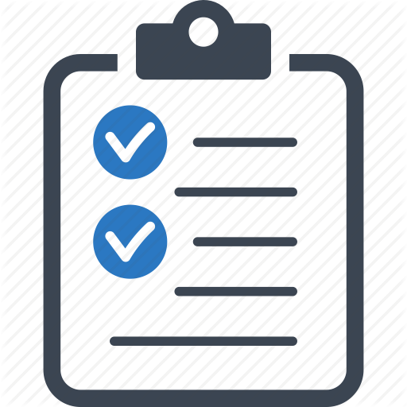

## ASAM Wiki
This Wiki provides information on how to set up your accounts and PC as well as how to work on ASAM projects.
Following these guidelines will minimize process overhead and increase the speed at which your input is integrated into the standard.

||Wiki Quick Access||
|:---:|:---:|:---:|
|<a href="docs/general_guidelines/Setup-Guide.asciidoc"> First Time Setup|<a href="https://www.google.de"> Teams & Sharepoint|<a href="https://www.google.de"> Shared Project Calendar|
|<a href="https://www.google.de"> Repository Worfklow Overview|<a href="https://www.google.de"> Project Guidelines|<a href="https://www.google.de"> Writing Guidelines|

---
---

### First Time Setup

You are new to ASAM projects? See the [setup guide](docs/general_guidelines/Setup-Guide.asciidoc) for a step-by-step on setting up your account and installing the tools we recommend for interacting with ASAM standards and repositories.

Additionally, see the guide to [Teams & Sharepoint](docs/general_guidelines/Microsoft-Teams-and-Sharepoint.adoc) for information on getting setup with Microsoft Teams.

Finally, [synchronise with the OpenX calendar](docs/general_guidelines/Shared-OpenX-Calendar.adoc), a shared calendar across all ASAM OpenX projects that lists all meetings taking place.

---
### Repository Workflow
See the [Workflow Overview](docs/general_guidelines/Workflow.asciidoc) for a walkthrough on how to actively develope the ASAM standards.

For a list of available labels in ASAM repositories, see this [overview of labels](docs/git/ASAM-Issue-and-MR-Labels.md).

---
### Project Guidelines
  - [Platforms & Communication Channels in an ASAM Project](docs/general_guidelines/Meeting-Guidelines)
  - [Meeting Guidelines](docs/general_guidelines/Meeting-Guidelines.md)
  - [Teams & Sharepoint](docs/general_guidelines/Microsoft-Teams-and-Sharepoint.adoc)
  - [Shared Project Calendar](docs/general_guidelines/Shared-OpenX-Calendar.adoc)
  - [ASAM Project Roles](docs/general_guidelines/ASAM-Project-Roles.md)
  - [ASAM DCO for Open Source Projects](docs/general_guidelines/ASAM-DCO.md)
  
---
### Writing Guidelines
  - [AsciiDoc Guide](docs/writing_guidelines/Asciidoc-Guide.adoc) 
  - Style Guidelines (TODO)
  - Writing Guide (TODO)

---
### Further Repository Guidelines
- [Commit message guidelines](docs/git/Commit-Guidelines.adoc) - Formatting guidelines for commit messages on commits/merges to the ASAM master branches
- [Branching](docs/git/Branching.md)
- [Forking](docs/git/Forking.md)
- [VSCode at ASAM](docs/tool-specific/VSCode-Guide.adoc)
