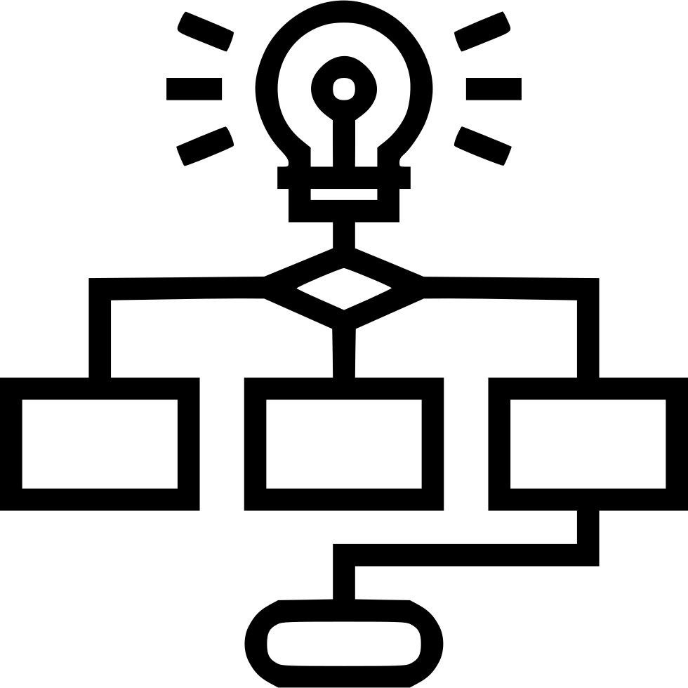

# ASAM Wiki
This Wiki provides information on how to set up your accounts and PC as well as how to work on ASAM projects.
Following these guidelines will minimize process overhead and increase the speed at which your input is integrated into the standard.

||Wiki Quick Access||
|:---:|:---:|:---:|
|<a href="docs/general_guidelines/Setup-Guide.asciidoc"> First Time Setup|<a href="docs/general_guidelines/Microsoft-Teams-and-Sharepoint.adoc"> Teams & Sharepoint|<a href="docs/general_guidelines/Shared-OpenX-Calendar.adoc"> Shared Project Calendar|
|<a href="docs/general_guidelines/Workflow.asciidoc"> Repository Worfklow Overview|<a href="docs/general_guidelines/ProjectGuidelines.adoc"> Project Guidelines|<a href="docs/general_guidelines/WritingGuidelines.adoc"> Writing Guidelines|

---
---

## First Time Setup

You are new to ASAM projects? See the [setup guide](docs/general_guidelines/Setup-Guide.asciidoc) for a step-by-step on setting up your account and installing the tools we recommend for interacting with ASAM standards and repositories.

Additionally, see the guide to [Teams & Sharepoint](docs/general_guidelines/Microsoft-Teams-and-Sharepoint.adoc) for information on getting setup with Microsoft Teams.

Finally, [synchronize with the OpenX calendar](docs/general_guidelines/Shared-OpenX-Calendar.adoc), a shared calendar across all ASAM OpenX projects that lists all meetings taking place.

---
## Repository Guidelines
See the [Workflow Overview](docs/general_guidelines/Workflow.asciidoc) for a walkthrough on how to actively develope the ASAM standards.

For a list of available labels in ASAM repositories, see this [overview of labels](docs/git/ASAM-Issue-and-MR-Labels.md).

---
## Project Guidelines
This covers all topics related to working in a project. 
The guidelines are collected under [Project Guidelines](docs/general_guidelines/ProjectGuidelines.adoc).
  
---
## Writing Guidelines
General writing guidelines can be found unter [Writing Guidelines](docs/general_guidelines/WritingGuidelines.adoc)
