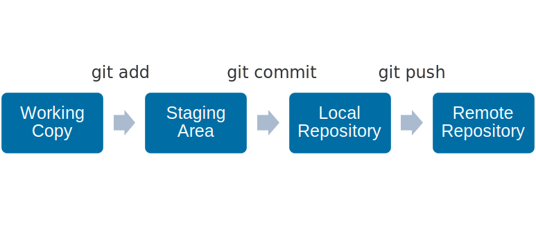

= An Introduction To Git

:toc:

== Terminology

Git:: A version control system. Used by ASAM in their projects.

GitLab:: Popular Open Source platform ASAM uses that leverages Git.

Remote:: The server, i.e. not on your PC, often used to refer to the master repository of a project on a server. The default name on (local) git is "origin".

Local:: A locally (on your pc) stored (cloned) version of the remote repository.

Working Copy:: Files that are not yet handled by git or that contain changes git is not "aware" of.

Staging Area:: Collection of files or changes that git is aware of but that are not yet part of the history.

Merge Request:: If the changes made in a separate branch of a project are to be combined with another branch (usually the main or master branch), a Merge Request is triggered to review the changes and solve any conflicts where two independently made changes on the same file would interfere with one another.

== Git Actions

Clone:: Done once to obtain a local copy of a remote repository. 

Add:: Will add new and changed files to the Staging Area.

Commit:: Save the state of a repository (ideally with a “commit message” that gives some background). This “snapshot” only applies to the local repository. It applies the staging area or, if used with the command '-a', all changes, staged or unstaged.

Push:: Copy the committed changes to the remote.

Pull:: Update your local copy with all changes that have been made to the remote.

Branch:: Diverge from the main line of development by creating a branch; this has a pointer to a specific commit in the parent to make it clear where it started.

Merge:: Integrate the changes made in one branch into another. Most times, this is used to integrate the changes from your branch to the main (master) branch.

== Working with Git

TIP: It is best practice to check for changes on remote before changing files locally and before pushing changes to remote. 

The Git workflow making changes is a 3 step process:

. Add files from the working copy to the staging area. 
. Commit staged files to your local repo
. Push to a remote repository.

== Further Information

- link:Git-Best-Practices.adoc[Git-Best-Practices]
- link:Branching.adoc[Branching in Git/GitLab]
- link:Branch-Naming-Conventions.adoc[Branch-naming Conventions]
- link:Forking.adoc[Forking in Git/Gitlab]
- link:ASAM-Issue-and-MR-Labels.adoc[Using Labels in Git and GitLab]
- link:Merge-Requests.adoc[Merge Requests (MR)]
